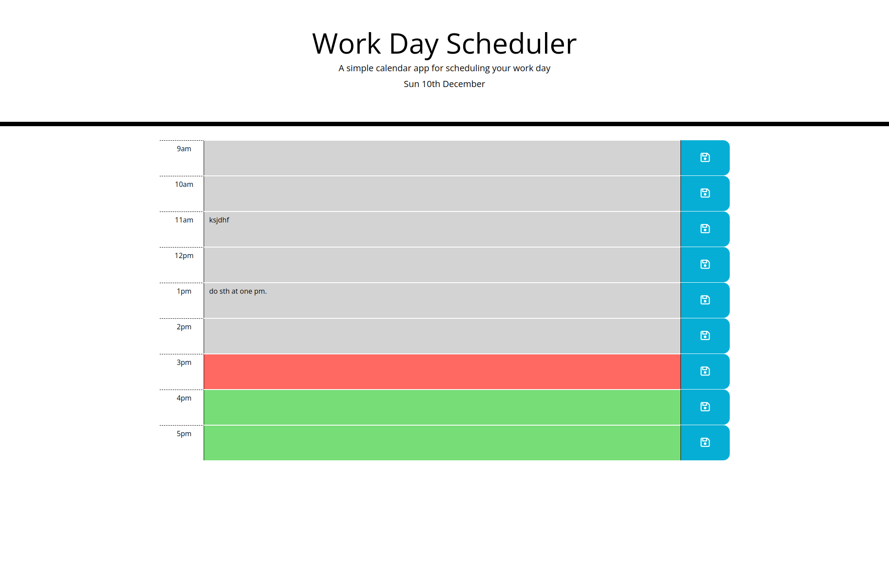

# Planner App

This is a simple planner app. You can enter your daily tasks for each hour of the day and save it. Every time you load
the page, all your previous tasks show up and are color coded based on time. If the task was for an earlier time than
now, it will be grey, if it's for the same hour as now, it will be red, and if it's for a later time than now, it will
be green. This app only works for the current day.

## Screenshot

## Webpage link

https://yrezvani.github.io/planner-app/
